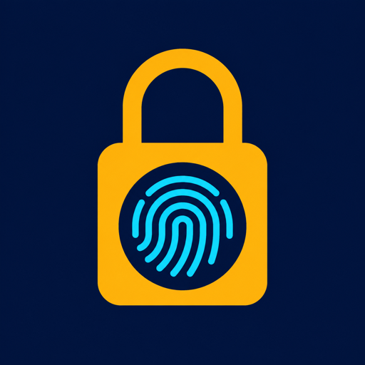

# Nimly Manager



Nimly Manager skal gi Home Assistant et bedre administrasjonslag for
Nimly-låser. Zigbee2MQTT er fortsatt transportlaget for den ordinære
lås-integrasjonen.

Repoet inneholder en første Home Assistant custom integration,
protokollkartlegging og forsiktige støtteverktøy.

## Installer med HACS

Repoet må først være publisert offentlig som
`https://github.com/aridder/nimly-manager`. Deretter:

1. Åpne **HACS → Integrations**.
2. Åpne menyen og velg **Custom repositories**.
3. Legg inn `https://github.com/aridder/nimly-manager` som typen
   **Integration**.
4. Last ned **Nimly Manager** og start Home Assistant på nytt.
5. Gå til **Innstillinger → Enheter og tjenester → Legg til integrasjon** og
   velg **Nimly Manager**.

Oppgi Zigbee2MQTTs base-topic, normalt `zigbee2mqtt`, og låsens eksakte
friendly name. MQTT-integrasjonen må allerede være konfigurert i Home
Assistant.

## Manuell installasjon

Kopier `custom_components/nimly_manager` til Home Assistants
`custom_components`-katalog og start Home Assistant på nytt. Legg deretter til
**Nimly Manager** under **Innstillinger → Enheter og tjenester**. Oppsettet spør
etter Zigbee2MQTT base-topic og låsens friendly name.

Integrasjonen abonnerer gjennom Home Assistants eksisterende MQTT-integrasjon.
Den åpner ikke en separat broker-forbindelse.

Fingeravtrykk registreres lokalt på låsen gjennom disse actions:

1. `nimly_manager.start_fingerprint_enrollment`
2. utfør trinnene som returneres av actionen
3. `nimly_manager.confirm_fingerprint_enrollment`
4. lås låsen og lås opp med den nye fingeren

`nimly_fingerprint_enrollment_verified` sendes bare etter en faktisk
låst-til-ulåst-overgang med fingerprint-kilde og forventet slot. En beholdt eller
gjentatt MQTT-state er ikke nok. Session-ID må brukes ved confirm og cancel, slik
at en gammel UI-handling ikke kan endre en nyere enrollment.

Rå MQTT-payloads lagres ikke. Feltet `last_used_pin_code` ignoreres og kommer
verken i event-data eller diagnostics.

## Utvikling og publisering

GitHub Actions kjører prosjektets tester, HACS-validatoren og Hassfest. Før en
GitHub Release må `version` i `manifest.json`, prosjektversjonen i
`pyproject.toml` og endringsloggen peke på samme versjon. Når versjonerte
releases brukes, krever HACS en full GitHub Release; en tag alene er ikke nok.

## Read-only BLE-probe

Proben finner Nimly-enheter som annonserer BLE-tjenesten `0xFD00`. Den skjuler
enhetsadresse og annonseringsdata som standard.

```bash
uv run --extra ble nimly-ble-probe scan
```

For å lese standardfeltet «Software Revision» fra én funnet enhet:

```bash
uv run --extra ble nimly-ble-probe inspect <probe-id>
```

`inspect` gjør bare GATT-lesing. Verktøyet har ingen kommandoer for å låse opp,
endre PIN/RFID, starte fingerprint-enrollment eller slette data.

På macOS må Codex/terminalprosessen ha Bluetooth-tilgang. Låsen kan også måtte
vekkes fysisk før den annonserer.

Kjør testene med:

```bash
uv run --extra test pytest
```

Se [fingerprint-enrollment.md](docs/fingerprint-enrollment.md) for beslutning og
sikkerhetsgrenser.
